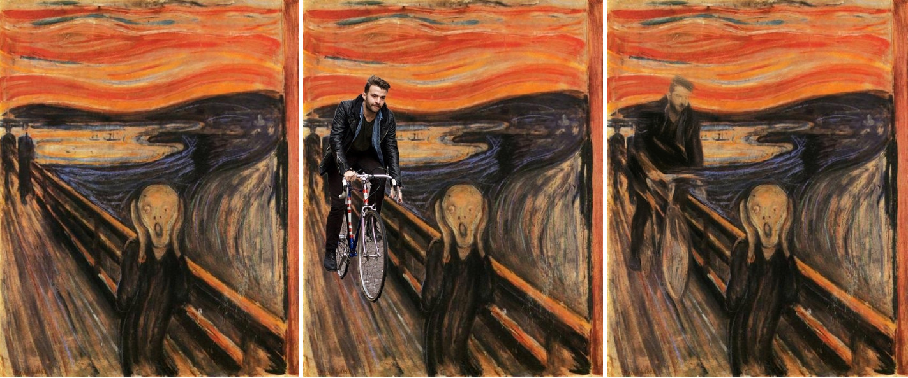
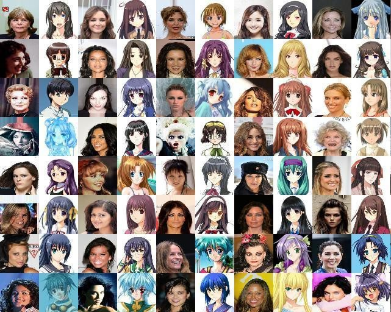
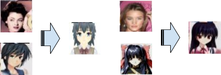

# 轻叩次元壁 -- 真人头像漫画化

*作者：李嘉铭*

## 引言

我成为宅之后一直抱有的一大遗憾，就是从小手残不会画画，唯一能提的恐怕只有在美术课上，把新垣结衣画成吴三桂之类的惨剧。

在接触了机器学习之后，感觉手残的我还可以拯救一下。毕竟现在的AI会下棋，会开车，还吟的一手好诗，会画画似乎也不是不可能。为此我研究了如下的课题：**能否打破次元壁，让AI把现实中的人脸转换成漫画风格的图片**？

事实上近几年来教AI画画的尝试数不胜数。我曾经的文章里介绍过其中的两个：**图像风格迁移**和用**生成对抗网络**(GAN)进行线稿上色，两者都和我们的课题密切相关。

## 图像风格迁移

*图像风格迁移最新成果 引自[Deep Painterly Harmonization][Deep Painterly Harmonization]*

简单来说，图像风格迁移是把一张画作的风格迁移到照片上的过程。风格可以包括笔触，用色，光影，物体比例等等。自从Gatys在2015年发明了用神经网络的图像迁移方法之后，一直困扰研究者的一个问题就是，由于图像风格迁移大多使用事先训练好的物品识别网络，而物品识别使用的训练集是**现实中**的图片，现有的图像迁移方法对于和现实中的物体比例不同的画风束手无策。具体到二三次元来说的话有两者头身比不同，眼睛鼻子大小不同等一系列问题。

其实最直接的解决方法也不难：**花钱**。请人标注一个专门用于艺术画作方面的数据集，并重新训练物品识别器，然而愿意花钱做这个苦差事的研究者寥寥无几。在用图像风格迁移把人脸转换成二次元风格就这样基本被堵死了。

## GAN

如果图像风格迁移是打破次元壁的一条路，那另一条路则是生成对抗网络，亦即所谓的GAN（Generative Adversarial Network）。[GAN][Generative Adversarial Nets]是现在大名鼎鼎的研究者Ian Goodfellow在2014年提出的用于生成任何数据的算法，只要给予足够的训练数据和时间以及足够强的神经网络。通过两个**互相博弈**的神经网络，GAN可以模仿并生成真假难辨的图像。比较有名的几个应用例子如用于二次元头像生成的[MakeGirlsMoe](https://make.girls.moe/#/)，以及英伟达(Nvidia)研究所推出的高清晰度真人头像生成模型[PGGAN](https://arxiv.org/pdf/1710.10196.pdf)。

*图片引自[PGGAN][PGGAN]*

经过几年的改进，现在的GAN已经能生成质量相当高的图片。不仅如此，**GAN还能将一类图片转换成另一类**。在2016年年底，伯克利大学的Phillip Isola等人提出了名为[pix2pix](https://arxiv.org/abs/1611.07004)的模型。给定成对的两类不同图片(比如地图和卫星图)，Pix2pix可以将两种类型的图片互相转换。与此同时，在Preferred Networks工作的Taizan Yonetsuji也提出了基于UNet的[线稿上色算法](https://zhuanlan.zhihu.com/p/24712438)。这两种算法对于我们的人脸次元转换课题来说再合适不过了，但可惜的是，两个算法都要求成对的训练图片，而由于资金成本原因，至今没有人发布过成对的二三次元人脸数据集。

*图片引自[pix2pix][pix2pix]*

## 无配对跨领域图像转换

必须使用不成对的图片的限制，使图像类型转换难度上升了一个等级，堪比在没有辞典的情况下学习一门新语言。

幸好，被贫穷限制想象力的貌似不止我一个，还有Facebook人工智能研究所。在2016年Facebook发布了一篇名叫[Unsupervised Cross-Domain Image Generation][Unsupervised Cross-Domain Image Generation]的论文，其核心内容便是如何在没有成对数据，但一类图像有标注的情况下做到两种类型图片之间的互相“翻译”。不久之后的2017年，Jun-Yan Zhu等人提出了名为[CycleGan][CycleGan]的用于**无标注不成对数据集**的模型。

这两个模型的一大共同之处便在于，为了解决数据集不配对的问题，两个模型都做了如下的假设：先把A类图片转换成B类，再把B类转换回A时,原图和经过两次翻译的图片之间不应该差太多。用翻译打个比方，把中文句子翻译成英文之后，再把英语句子翻译回中文时得到的应该是和一开始相同的句子，而二次翻译之后与原输入不同之处就可以当作**循环误差(cycle consistency loss)**.。CycleGAN就是通过减少循环误差来训练神经网络，并做到两类不配对的图片之间的互相转化。

*图片引自[Unsupervised Cross-Domain Image Generation论文][Unsupervised Cross-Domain Image Generation]*

## 尝试CycleGAN

好消息是，CycleGan有现成的开源代码。找到现有的算法之后，我开始收集训练所需的数据。我用CelebA的20万张图片作为三次元头像数据库，用[MakeGirlsMoe][MakeGirlsMoe]里提到的方法从日本游戏网站Getchu截取了共计约3万张二次元头像。

*二次元头像数据集例子 图片引自[Getchu](http://www.getchu.com/soft.phtml?id=933144) (佐仓大法好)*

结果如下：

看上去过得去，但似乎哪里不太对。。。事实证明，CycleGAN也有它的局限性。它对还原误差的要求使它不得不将原图中的所有信息都一一对应到翻译后的图片中。而在三次元到二次元的转换过程中，二次元和三次元的信息并不对称。比如三次元的人脸在细节方面明显多于二次元，而二次元的发色，瞳色又是三次元里不常见的。要求二三次元之间一对一互相映射显然是不太合理的，而用这种不合理的损失函数训练的结果并不会好。如何在没有标注数据的情况下，尽量保留能够互相对应的部分，而在无法一一对应之处有所创新，把三次元头像转换为二次元？

## 换个角度再试一次！

幸运的是，在现有的GAN算法行不通的时候，还有图片风格迁移方面的经验可以借鉴。早在2016年，谷歌大脑（Google Brain）的Vincent Dumoulin等人便发现，仅仅让神经网络学习Batch Norm(批规范化层)中的两个参数，就可以实现让一张图片转换成许多不同风格的效果，甚至可以把不同的风格互相混搭。他们的论文[A Learned Representation For Artistic Style][A Learned Representation For Artistic Style]表明，本来用于让神经网络训练更稳定的Batch Norm参数还有更多可发掘的潜力。

### Twin-GAN - 技术细节

借鉴了以上提到的想法，并经过一些尝试之后，我确定了如下名叫Twin-GAN的网络结构：在图像生成器方面我用了至今效果最好的英伟达的[PGGAN](https://arxiv.org/pdf/1710.10196.pdf)。由于PGGAN的输入是一个随机的高维向量，而我们的输入是一张图片，所以我用了和PGGAN对称的编码器（encoder）将输入的头像图片编码为高维向量，并且为了还原图片的细节，我用了UNet的结构将编码器和图像生成网络之间的卷积层连接了起来。我的神经网络的输入和输出主要有三种：
1. 三次元头像->编码器->高维向量->PGGAN生成器+三次元用Batch Norm参数->三次元头像
2. 二次元头像->编码器->高维向量->PGGAN生成器+二次元用Batch Norm参数->二次元头像
2. 三次元头像->编码器->高维向量->PGGAN生成器+二次元用Batch Norm参数->二次元头像

和[Facebook的论文][Unsupervised Cross-Domain Image Generation]里提到的一样，让三次元和二次元头像共用一个编码器和一个生成器的主要目的是让神经网络能够认识到，虽然长的不太一样，二次元和三次元的图片所描绘的内容都是人脸。这对于二三次元的转换至关重要。而最终决定是二次元还是三次元的开关就在Batch Norm参数里。

损失函数方面，我主要用了以下四个函数:
1. 三次元到三次元的还原损失函数(l1+GAN loss)
2. 二次元到二次元的还原损失函数(l1+GAN loss)
3. 三次元到二次元的GAN损失函数
4. 三次元到二次元的循环损失函数(cycle consistency loss)。

## 成果
实际训练完成后的效果如下：

Twin-GAN的功能不止于此。由于二三次元的图片共享同一个embedding(嵌入向量)，我可以抽取图片的embedding用于最近邻检索(Nearest Neighbor Search)，可以同时在二次元和三次元寻找与之最相似的图片。

大部分还挺准的吧。从这里可以看出我们训练的神经网络对于图片的理解。对于金色的头发它觉得和动漫里的颜色差不多，而三次元的棕色颜色的头发它觉得对于二次元世界太过无聊，所以略施小计把大家都染了个发。表情发型在有些图片中也能找到一些对应，而对于不能对应的部分神经网络会有所创新。比如中间靠右戴着俄罗斯冬帽的妹子，由于二次元数据集里没有戴这类帽子，所以神经网络索性就把它当成了发饰。

不理想的地方也在这张图中一目了然，有些时候它会把背景也当作头发的颜色来利用（如左下角），还有些时候他会把人的朝向弄反，这些错误在图片转换的时候也能见到。

其实我们的算法应用范围不只是二三次元转换，拿猫脸来训练会怎么样？

喵！感觉被治愈了。尽管看上去还不错，不过还是有许多时候，我可能对一张图片的转换效果不太满意，比如原图是黑发，而我想在转换后二次元头像里有绿色的发色。之前设计的网络结构并不支持对这些细节的直接调整，因此我借鉴了[Conditional generative adversarial nets][Conditional generative adversarial nets]，用[illust2vec][illust2vec]提取出角色的发色，瞳色，以及相关的一系列信息，并在训练神经网络的同时把这些信息通过特征向量（embedding）提供给了生成器。在生成图片的时候，我额外给神经网络一张二次元角色头像作为输入，转换后的图片会变成了那个角色的样子，并保留了原三次元图片的姿势及表情(TODO)。效果大概是这样的：

结果还远不够完美，可以进一步改进。但重要的是，我现在有了**可以把三次元头像变成动物，AI原创角色或者任何二次元角色的算法**，再也不用担心手残了。

## 后记：

现有算法最大的问题之一还是在数据集上，由于我收集的二次元头像大多为女性，所以神经网络会把三次元男性娘化成二次元女性。另外不正确的把背景当作发色，忽略以及错误的识别某些特征之类的也常有发生，比如以下就是一个失败的例子：

需要做的不止是改进优化现有的模型，此外，在三次元和二次元的互相转换方面能做的其实还有很多，比如如何将生成的图片从人脸拓展成更加丰富多样的图片，比如在生成结果不满意的时候如何实时改进，又或将这个算法拓展到视频上等等。

值得一提的是，前几个月由Shuang Ma提出的利用Attention Map的名为[DA-GAN][DA-GAN]的图片生成算法也有不错的效果，其中的算法也有许多值得借鉴的地方。并且英伟达就在**昨天**(2018/4/15)公布了他们[最新的研究](https://blogs.nvidia.com/blog/2018/04/15/nvidia-research-image-translation/)，展示了能够把猫变成狗的神经网络。这让我更加期待将来图像转换领域的进一步发展。This is exciting!

相关论文以及网站会视情况尽快推出，相关更新敬请关注我的知乎帐号。感谢阅读！

注：本文为了方便理解，简化了许多论点，并不严禁，还请注意和谅解。对技术细节有兴趣的可以读引用部分的论文。

Link to the English Version

## 引用

[A Neural Algorithm of Artistic Style][A Neural Algorithm of Artistic Style]

[MakeGirlsMoe][MakeGirlsMoe]

[PGGAN][PGGAN]

[CycleGAN][CycleGAN]

[pix2pix][pix2pix]

[A Learned Representation For Artistic Style][A Learned Representation For Artistic Style]

[Unsupervised Cross-Domain Image Generation][Unsupervised Cross-Domain Image Generation]

[DA-GAN][DA-GAN]

[Spectral Normalization for Generative Adversarial Networks][Spectral Normalization for Generative Adversarial Networks]

[Conditional generative adversarial nets][Conditional generative adversarial nets]

[illust2vec][illust2vec]

[Deep Painterly Harmonization][Deep Painterly Harmonization]

[Generative Adversarial Nets][Generative Adversarial Nets]

[Multimodal Unsupervised Image-to-Image Translation][Multimodal Unsupervised Image-to-Image Translation]

[A Neural Algorithm of Artistic Style]: https://arxiv.org/pdf/1508.06576.pdf
[MakeGirlsMoe]: https://makegirlsmoe.github.io/main/2017/08/14/news-english.html
[PGGAN]: https://arxiv.org/pdf/1710.10196.pdf
[CycleGAN]: https://junyanz.github.io/CycleGAN/
[pix2pix]: https://github.com/phillipi/pix2pix
[A Learned Representation For Artistic Style]: https://arxiv.org/abs/1610.07629
[Unsupervised Cross-Domain Image Generation]: https://arxiv.org/pdf/1611.02200.pdf
[DA-GAN]: https://arxiv.org/abs/1802.06454
[Spectral Normalization for Generative Adversarial Networks]: https://arxiv.org/abs/1802.05957
[Conditional generative adversarial nets]: https://arxiv.org/pdf/1411.1784.pdf
[illust2vec]: https://github.com/rezoo/illustration2vec
[Deep Painterly Harmonization]: https://arxiv.org/abs/1804.03189
[Generative Adversarial Nets]: http://papers.nips.cc/paper/5423-generative-adversarial-nets
[Multimodal Unsupervised Image-to-Image Translation]: https://arxiv.org/abs/1804.04732